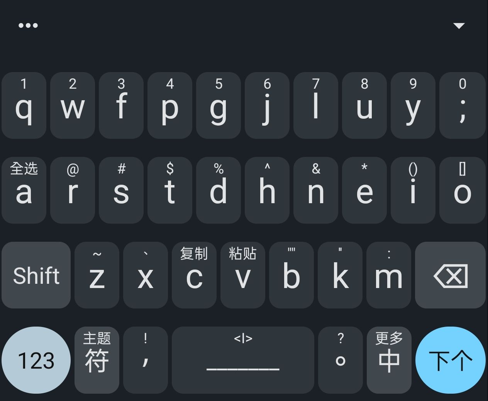

# Trime Theme like Gboard Colemak

這是一個同文輸入法仿 Gboard 的主題，Fork 自 [Trime_Theme](https://github.com/RzdPai/Trime_Theme)，我只是把原版的 QWERTY 佈局改成了 **Colemak**。

### 📌 説
* **致謝**：誠摯感謝[原作者](https://github.com/RzdPai)提供的源碼，也感謝 [Trime](https://github.com/osfans/trime) 和 [Rime](https://github.com/rime) 提供的最基礎的框架，不然什麽都是空談。
* **聲明**：本項目主要是**個人自用**，可能有很多不完善的地方，僅分享給同樣使用 Colemak 佈局的同好參考。

### 📸 預覽

